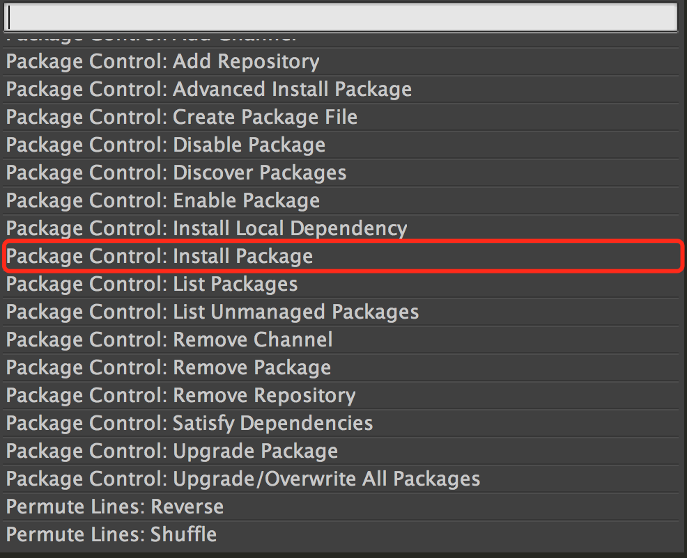
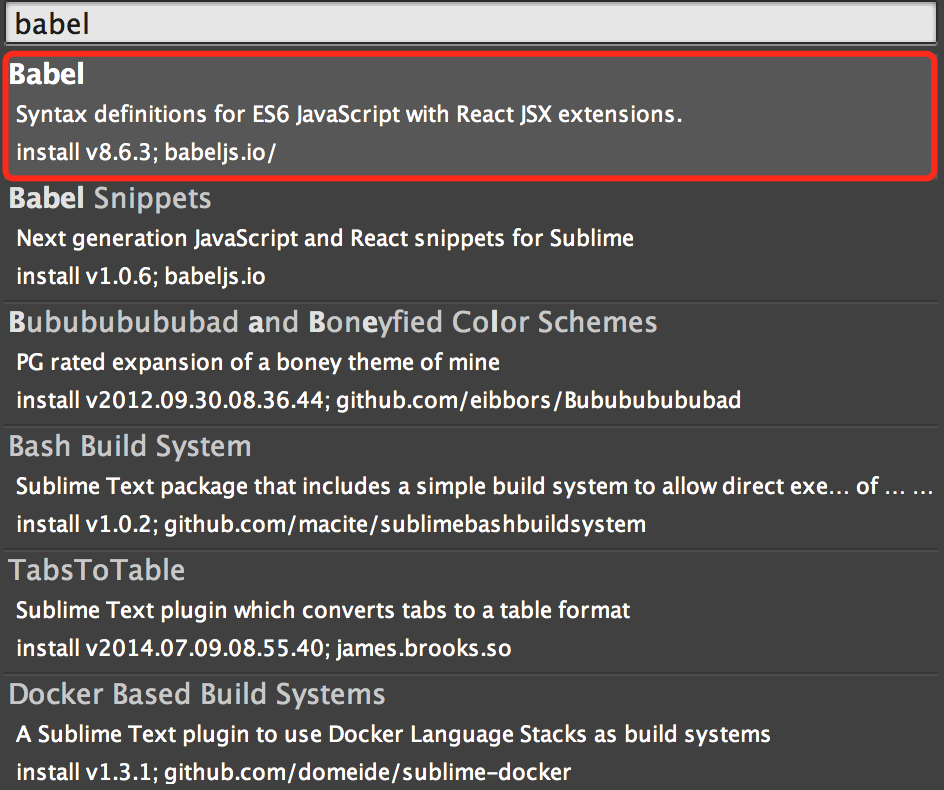

# sublime text3 支持 JSX、eslint
## JSX语法支持
为了让 sublime text3（以下简称 sublime3） 支持 JSX 的高亮显示，需要安装 [babel-sublime](https://github.com/babel/babel-sublime) 这个 package。
#### 安装 Babel
sublime3  的 package 安装方法有两种.
##### 自动下载安装
1. 进入 Package 安装面板：`Preferences` `->` `Package Control` `->` `Package Control: Install Package`

	> 也可以使用快捷键：`Cmd+shift+p`

	
2. 输入 babel, 点击 `Babel` 即可自动安装

	
##### 手动下载安装
`Preferences` `->` `Browse Packages...` 打开 Package 的路径，将 [babel-sublime](https://github.com/babel/babel-sublime) 代码手动下载到该路径下即可

#### 将JSX文件设置为Babel解析
1. 打开一个JSX文件
2. `View` `->` `Syntax` `->` `Open all with current extension as...` `->` `Babel` `->` `JavaScript (Babel)`

这样，sublime3 就可以支持 JSX 的解析了，然后将JS文件也设置为Babel解析

## eslint 支持
[eslint](http://eslint.org/) 是一个代码检查工具，主要用来避免低级错误和统一代码的风格，sublime3 配置了 eslint 之后，在编写代码的时候，可以及时发现不符合 eslint 规则的代码.

#### 安装 eslint
1. 全局安装 eslint

	```
	npm install -g eslint
	```
2. 为项目配置规则

	在根目录中生成 `.eslintrc`，将相关规则写入该文件

#### sublime3 安装 Package
需要安装：`SublimeLinter3`、`Sublime-contrib-eslint` 两个 Package

安装之后，重启 sublime3，就可以进行代码检查了

## 参考文档
- https://medium.com/@junshengpierre/making-the-switch-from-jshint-to-eslint-5b6c4fa3c92a
- https://segmentfault.com/a/1190000003698071